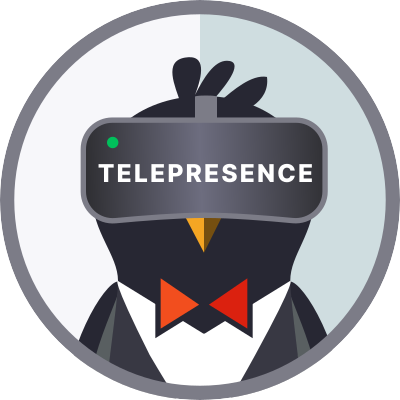

# Terminal 22 - Accelerate development with [Telepresence](https://www.telepresence.io/)

Migrating to kubernetes and splitting into microservices has given a lot of advantages but
developing and testing these services on a remote Kubernetes cluster can be challenging for these reasons:

- Slow feedback loops: once a code change is made and want to be tested in a Kubernetes cluster, it requires to be deployed running a 
deployment pipeline. This requires few minutes to be completed and so it is time-consuming.
- Memory and CPU can be insufficient if we want to run all the services locally.

Telepresence might be really useful to overcome these limitations.

## What is Telepresence
Telepresence is an open source tool which allow to make changes to your service locally without having to run all the dependencies on your local machine.

Using telepresence allows you to use custom tools, such as a debugger and IDE, for a local service and provides the service full access to ConfigMap, secrets, and the services running on the remote cluster.

The aim of this is to investigate more about this tool and find out if it might be useful introduce it in our tech stack.

### How does it work?
Telepresence consists of two architecture components: 
- the client-side (CLI) telepresence binary
- the cluster side (Kubernetes or Openshift) traffic-manager and traffic-agent.

Two main capabilities:
- access to the remote K8s services as if they were running locally using the command `` telepresence connect``
- route remote traffic to your local dev machine with the command `` telepresence intercept <service-name> ``
  - a proxy container is injected into the pods associated to the target services

### More info
- [Official doc](https://www.telepresence.io/)
- [GitHub repository](https://github.com/telepresenceio/telepresence)
- [Telepresence for Docker](https://www.docker.com/products/telepresence-for-docker/)

## Let's demo it!

### Prerequisites
- Java 17
- **kubectl** or **oc** CLI installed and configured.
- A Kubernetes cluster.
  - Docker Desktop or Minikube if you want to install a single node cluster locally.

### Checkout and test the simple Spring Boot Service
This repository contains a Spring Boot application which exposes a simple web API and returns a welcome message with
the current services' version:

```shell
curl http://localhost:8080/example-service-telepresence/

Hello from example-service-telepresence v1!
```

### Create the docker image

Create and push in the local container registry following these steps:
- build a Docker image with Jib and push to the local container register using the following command: `` ./gradlew jibDockerBuild ``
- run this command to check the images are present: `` docker images | grep example-service-telepresence ``
- if you are using Minikube, load the image into it with the command: `` minikube image load example-service-telepresence:<version> ``

### Deploy the example-service-telepresence to your K8s cluster

#### Run the following command:
```shell
example-service-telepresence % kubectl apply -f k8s-manifests/deployment.yaml
namespace/t22 created
service/example-service-telepresence created
deployment.apps/example-service-telepresence created
```
#### Check if everything is running with command:
```shell
example-service-telepresence % kubectl get all -n t22
NAME                                                READY   STATUS    RESTARTS   AGE
pod/example-service-telepresence-69df788d9f-gm5kt   1/1     Running   0          3s

NAME                                   TYPE        CLUSTER-IP       EXTERNAL-IP   PORT(S)    AGE
service/example-service-telepresence   ClusterIP   10.107.104.105   <none>        8080/TCP   4s

NAME                                           READY   UP-TO-DATE   AVAILABLE   AGE
deployment.apps/example-service-telepresence   1/1     1            1           3s

NAME                                                      DESIRED   CURRENT   READY   AGE
replicaset.apps/example-service-telepresence-69df788d9f   1         1         1       3s
```

### Install Telepresence
Install Telepresence on your machine and in your K8s cluster following this guide: https://www.telepresence.io/docs/latest/quick-start/

    


